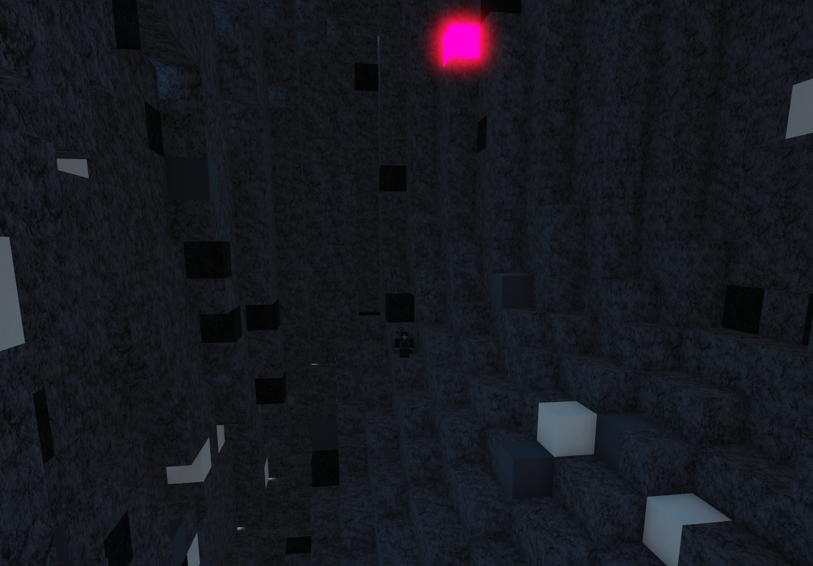

# rbx-mininggridsystem

A few foundational ModuleScripts I wrote for the Interstellar Mines Roblox game (cancelled) in the Summer of 2023. These allow to create and manage a 3d block grid system for a mining game (may be repurposed).
Grid.lua notably contains a function to generate random and natural-looking caves.
Layers.lua features a function to get a random block based on depth (see Layers.lua) and the block's probability.

**Note : This system is serversided. This is not optimal for bandwidth usage and UX. However, it's completely feasible to make a secure system with the client caching the block grid.**

The code could certainly be improved but I'm sure it could help some learners out there.

## Business logic
A grid (or mine) is a 3d grid containing blocks (which can be mined). Each block has an associated Part object and spawn chance. Layers.lua also contains hard-coded layers which define vertical sections in a mine with their depth interval and blocks. Rarity.lua is used to calculate a block's rarity.

## Random info
Blocks are simply cubical parts.
RemoteEvents in Grid.lua are used to send updates concerning the mine's status to the client.
Utility.lua also contains a function to send a webhook to a Discord server from a Roblox game using a proxy.

Feel free to contact @idraumel on Discord if you have questions.